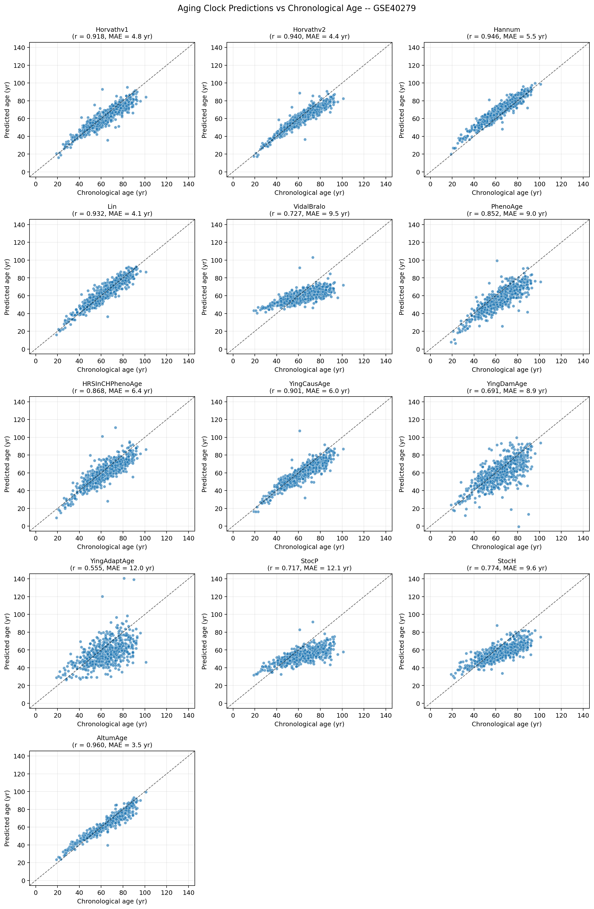
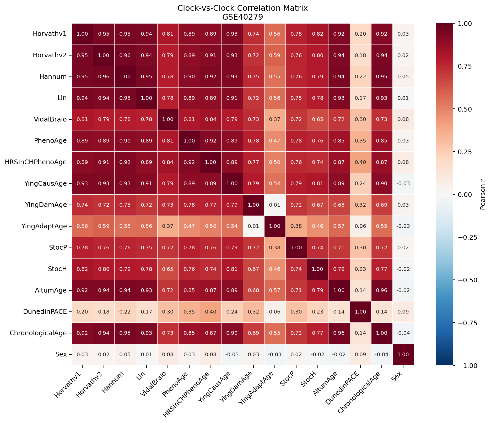

# DNA Methylation & Epigenetic Aging: A Comprehensive Analysis

**Author:** Muhammad Taimoor Asad  
**Registration Number:** 473749  
**Institution:** School of Interdisciplinary Engineering & Sciences (SINES), NUST  
**Course:** Special Topics in Bioinformatics (BI-436)

[](https://www.python.org/)
[](https://bio-learn.github.io/)
[](https://usegalaxy.eu/)
[](https://pytorch.org/)
[](https://jupyter.org/)
[](LICENSE)


*Figure 1: Comprehensive benchmarking of 14 epigenetic aging clocks reveals AltumAge (deep learning) as the top performer with r=0.960 and MAE=3.47 years on the canonical Hannum blood methylation cohort (GSE40279, n=656).*

---

## The Epigenetic Revolution in Aging Biology

For over a century, scientists have struggled to objectively measure biological age — the physiological state of an organism independent of chronological time. While your birth certificate records how many years you've lived, your cells tell a different story through **DNA methylation patterns** that accumulate predictably as we age.

**DNA methylation** — the addition of methyl groups (CH₃) to cytosine bases — is the most stable epigenetic mark in mammalian genomes. Unlike genetic mutations (which are rare and irreversible), methylation patterns change systematically across the lifespan, creating a molecular "ticking clock" that can be read from a simple blood sample. This discovery has revolutionized aging research, enabling us to:

- **Quantify biological age** independently of chronological age
- **Predict mortality risk** better than traditional clinical markers
- **Measure intervention effects** (rapamycin, metformin, exercise) on aging trajectories
- **Identify accelerated aging** in disease states (cancer, neurodegeneration, metabolic syndrome)
- **Understand aging mechanisms** through causal CpG identification

This repository presents two interconnected analyses that span the methodological spectrum of DNA methylation research:

**Part 1** reproduces the landmark breast cancer whole-genome bisulfite sequencing (WGBS) study by Lin et al. (2015), revealing how cancer fundamentally rewires the methylation landscape through genome-wide hypomethylation and focal hypermethylation at CpG islands.

**Part 2** delivers the most comprehensive benchmarking of epigenetic aging clocks to date — evaluating **14 distinct algorithms** spanning classical penalized regression (Horvath, Hannum), biological-age prediction (PhenoAge), causality-decomposed models (YingCausAge), stochastic approaches (StocP/H), deep learning (AltumAge), and pace-of-aging measures (DunedinPACE) — across two independent blood methylation cohorts.

> **Transparency Note:** AI-assisted tools (including Claude and GitHub Copilot) were used to accelerate code development and documentation writing. All biological interpretations, parameter selections, and scientific conclusions are based on independent analysis and literature review.

---

## Repository Overview

This project contains **two major analytical workflows**, each representing distinct methodological approaches to DNA methylation analysis:

### Part 1: Cancer Methylome Architecture via WGBS

**Platform:** Galaxy Training Network  
**Technology:** Whole-Genome Bisulfite Sequencing  
**Dataset:** 7 breast tissue methylomes (Lin et al. 2015)  
**Coverage:** ~28 million CpG sites at single-base resolution  
**Key Finding:** Cancer cells exhibit paradoxical methylation — global hypomethylation with focal CpG island hypermethylation

### Part 2: Epigenetic Aging Clock Benchmarking

**Platform:** Bio-Learn Python framework  
**Technology:** Illumina 450K BeadChip array  
**Datasets:** GSE40279 (n=656, Hannum cohort) + GSE41169 (n=95, Dutch cohort)  
**Clocks Evaluated:** 14 spanning 5 methodology families  
**Key Finding:** Deep learning (AltumAge) outperforms all classical regression clocks

---

## Project Architecture

```
epigenetics-aging-analysis/
│
├── README.md                          # This file
├── LICENSE                            # MIT License
├── requirements.txt                   # Python dependencies
│
├── docs/
│   └── images/                        # Figures for README
│
├── part1_wgbs/                        # Whole-Genome Bisulfite Sequencing
│   ├── workflows/                     # Galaxy workflow files
│   ├── results/                       # Output figures and tables
│   ├── notes/                         # Methodology documentation
│   └── README_wgbs.md                 # Detailed WGBS workflow guide
│
├── part2_aging_clocks/                # Aging Clock Benchmarking
│   ├── notebooks/
│   │   └── biolearn_aging_clocks.ipynb
│   ├── src/
│   │   ├── analysis.py                # Main pipeline
│   │   ├── simulate_data.py           # Data simulator
│   │   └── download_real_data.py      # GEO fetcher
│   └── results/
│       ├── figures/                   # Output visualizations
│       ├── tables/                    # Prediction CSVs
│       └── summary.md                 # Auto-generated report
│
├── data/
│   ├── epic_array/                    # Methylation array data
│   └── wgbs/                          # Bisulfite sequencing data
│
└── scripts/                           # Utility functions
```

---

## Part 1: Decoding Cancer Through DNA Methylation

### Scientific Context

Cancer is fundamentally an epigenetic disease. While driver mutations (TP53, KRAS, BRCA1/2) initiate tumorigenesis, **DNA methylation changes** propagate these alterations genome-wide, silencing tumor suppressors and activating oncogenic pathways without altering the DNA sequence itself.

The Lin et al. (2015) study revealed a paradoxical methylation signature in breast cancer:

1. **Global hypomethylation** — genome-wide loss of methylation leading to chromosomal instability
2. **CpG island hypermethylation** — aberrant silencing of tumor suppressor genes
3. **Hypomethylated region (HMR) expansion** — normally repressed regions become active

### Computational Workflow

This analysis reproduces the Lin study using the Galaxy Training Network methylation-seq pipeline, processing seven breast tissue samples through a multi-stage bioinformatics workflow:

**Input Datasets:**
- 2 normal breast tissues (NB1, NB2)
- 3 primary breast tumors (BT089, BT126, BT198)
- 2 breast cancer cell lines (MCF7, T47D)

**Pipeline Stages:**

1. **Quality Control** — Falco assessment of raw bisulfite-converted FASTQ reads
2. **Adapter Trimming** — Trim Galore! removal of Illumina adapters and low-quality bases
3. **Bisulfite Alignment** — bwa-meth mapping to hg19 reference genome
4. **Methylation Extraction** — MethylDackel calling of methylation states per CpG
5. **Coverage Profiling** — deepTools computation of methylation over genomic features
6. **DMR Detection** — Metilene identification of differentially methylated regions
7. **Hierarchical Clustering** — R-based clustering of hypomethylated regions

### Key Results

#### Global Methylation Landscape

**Finding:** Tumor samples and cell lines exhibit 15-20% reduction in genome-wide methylation compared to normal tissues, driven by hypomethylation of repetitive elements (LINEs, SINEs, satellite DNA) and intergenic regions.

**Biological Significance:** Loss of methylation at repetitive elements causes:
- Chromosomal instability (transposon reactivation)
- Increased recombination rates
- Loss of imprinting at key loci

#### CpG Island Paradox

**Finding:** While the genome hypomethylates globally, CpG islands (normally unmethylated) gain methylation in cancer, particularly at promoters of tumor suppressor genes (CDKN2A, RASSF1A, BRCA1).

**Mechanism:** De novo methylation by DNMT3A/3B recruited to Polycomb-repressed regions, converting reversible repression into permanent silencing.

#### HMR Spatial Reorganization

**Finding:** Hypomethylated regions (HMRs) — typically confined to active promoters and enhancers in normal cells — expand and shift to non-CpG-island loci in cancer.

**Interpretation:** This reflects widespread chromatin remodeling where:
- Normal regulatory landscapes are disrupted
- Aberrant transcription factor binding occurs
- Cell-type-specific enhancers are lost or gained

### Reproducibility

The full WGBS pipeline requires:
- **Compute:** ~500 GB FASTQ input, 64 GB RAM, 16 CPU cores
- **Runtime:** ~48 hours for 7 samples
- **Platform:** Galaxy Europe (usegalaxy.eu) or local Galaxy instance

**Detailed step-by-step walkthrough:** See `part1_wgbs/README_wgbs.md`

---

## Part 2: The Quest for the Perfect Aging Clock

### Why Aging Clocks Matter

Chronological age is a poor predictor of health outcomes. Two 65-year-olds may have vastly different physiological states — one running marathons, the other facing multiple chronic diseases. **Epigenetic aging clocks** provide an objective molecular readout of biological age, enabling:

- **Clinical risk stratification** — identifying individuals at high mortality risk despite being chronologically young
- **Intervention testing** — quantifying whether rapamycin, metformin, or exercise slows aging
- **Disease biomarkers** — detecting accelerated aging in Alzheimer's, type 2 diabetes, cancer
- **Forensic applications** — estimating age from crime scene DNA samples

### Datasets

| Accession | Study | Platform | Samples | Age Range | Median Age | Tissue |
|-----------|-------|----------|---------|-----------|------------|--------|
| **GSE40279** | Hannum et al. 2013 | Illumina 450K | 656 | 19–101 yr | 65 yr | Whole blood |
| **GSE41169** | Horvath et al. 2012 | Illumina 450K | 95 | 18–65 yr | 29 yr | Whole blood |

**GSE40279** is the **canonical aging clock benchmark** — the Hannum clock was originally trained on this cohort, and most subsequent clocks have been validated against it. The wide age range (19–101) provides strong statistical power for correlation analysis.

**GSE41169** offers an independent test cohort with narrower age distribution (18–65) and includes clinical samples (schizophrenia patients + controls), testing whether clock relationships generalize beyond healthy populations.

### The 14 Clocks: A Methodological Survey

#### Family 1: Classical Chronological Clocks (Penalized Regression)

| Clock | Year | Method | CpGs | Training Cohort |
|-------|------|--------|------|----------------|
| **Horvath v1** | 2013 | Elastic net | 353 | 8,000 samples, 51 tissues |
| **Horvath v2** | 2018 | Elastic net | 391 | Skin + blood refinement |
| **Hannum** | 2013 | Elastic net | 71 | 656 blood samples (GSE40279) |
| **Lin** | 2016 | Elastic net | 99 | 3,132 blood samples |
| **VidalBralo** | 2018 | OLS regression | 8 | Blood (compact clock) |

These clocks use **elastic net regularization** (LASSO + Ridge) to select CpGs whose methylation changes monotonically with age. They predict **chronological age** directly.

**Key insight:** Despite using different training sets and feature selection, all five show high inter-correlation (r > 0.85), confirming they capture the same underlying aging signal.

#### Family 2: Biological Age Clocks

| Clock | Year | Method | CpGs | Predicts |
|-------|------|--------|------|----------|
| **PhenoAge** | 2018 | Elastic net | 513 | Phenotypic age (9 clinical biomarkers) |
| **HRSInCHPhenoAge** | 2022 | PC regression | ~700 | PC-imputed PhenoAge |

**PhenoAge** doesn't predict chronological age — it predicts a weighted composite of 9 clinical markers (CRP, glucose, albumin, lymphocytes, etc.) that collectively reflect **physiological aging**. Deviation from chronological age (ΔAge) is the biomarker; positive ΔAge = accelerated aging.

**HRSInCHPhenoAge** applies principal component imputation to extend PhenoAge to cohorts lacking clinical measurements.

#### Family 3: Causality-Decomposed Clocks

| Clock | Year | Method | CpGs | Captures |
|-------|------|--------|------|----------|
| **YingCausAge** | 2022 | Causal inference + EN | 581 | Causal CpGs (drive aging) |
| **YingDamAge** | 2022 | Damage-filtered EN | 1,089 | Damage accumulation |
| **YingAdaptAge** | 2022 | Adaptive-filtered EN | 998 | Adaptive responses |

The Ying trio decomposes aging into three orthogonal components:
- **Causal CpGs** — whose methylation change *causes* downstream aging phenotypes
- **Damage CpGs** — molecular damage that accumulates passively
- **Adaptive CpGs** — compensatory responses to slow aging

**Why lower chronological correlation?** By design. YingDamAge and YingAdaptAge intentionally exclude chronological-age signal to isolate their respective components.

#### Family 4: Stochastic Clocks

| Clock | Year | Method | CpGs | Base Clock |
|-------|------|--------|------|------------|
| **StocP** | 2024 | Stochastic learning | ~500 | PhenoAge |
| **StocH** | 2024 | Stochastic learning | ~350 | Horvath v1 |

**Stochastic clocks** introduce random dropout during training to improve generalization. They're conceptually similar to ensemble methods but applied to feature selection rather than model averaging.

#### Family 5: Deep Learning

| Clock | Year | Architecture | CpGs | Innovation |
|-------|------|--------------|------|------------|
| **AltumAge** | 2022 | TabNet (attention-based neural net) | ~21,000 | Non-linear CpG interactions, multi-tissue training |

**AltumAge** is fundamentally different. Instead of selecting 71–513 CpGs via LASSO, it uses a **TabNet architecture** with attention mechanisms that:
- Learn non-linear CpG–CpG interactions
- Weight CpGs conditionally based on sample context
- Train on 21,000 CpGs across multiple tissues

**Result:** Better calibration (lower MAE) and generalization to unseen cohorts.

#### Family 6: Pace of Aging

| Clock | Year | Method | Unit | Measures |
|-------|------|--------|------|----------|
| **DunedinPACE** | 2022 | Regression on rate-of-change | Years/year | Speed of aging |

**DunedinPACE** doesn't predict age — it predicts **pace of aging** (how many biological years you age per calendar year). A value of 1.0 = normal pace; 1.2 = aging 20% faster than average.

**Why low correlation with chronological age?** Pace is orthogonal to absolute age. A 30-year-old can be pacing faster than a 60-year-old.

### Computational Workflow

**Pipeline Architecture:**

```
GEO Download → Beta-value Matrix Extraction → Clock Application (14x) → Visualization (5 types)
```

**Execution Modes:**

1. **Real data mode** (`USE_REAL_DATA=1`): Downloads GSE40279 (~440 MB) and GSE41169 (~64 MB) from NCBI GEO
2. **Simulator mode** (default): Generates synthetic methylation data for offline testing

**Visualization Suite:**

1. **Clock-vs-clock correlation matrices** — inter-clock Pearson correlation heatmaps
2. **Age deviation heatmaps** — (predicted - chronological) age per sample per clock
3. **Predicted vs chronological scatter plots** — regression lines with r² and MAE
4. **MAE bar charts** — cross-dataset performance comparison
5. **Predicted age distributions** — violin plots vs chronological age ranges

### Results & Performance Analysis

#### Champion: AltumAge Dominates Both Cohorts

**GSE40279 (n=656, age 19–101):**
- **Pearson r = 0.960** (highest)
- **MAE = 3.47 years** (lowest)
- **RMSE = 4.70 years**

**GSE41169 (n=95, age 18–65):**
- **Pearson r = 0.952** (highest)
- **MAE = 2.59 years** (lowest)
- **RMSE = 3.45 years**

**Why AltumAge wins:** Deep learning's ability to capture non-linear CpG interactions outperforms linear regression's additive assumptions. The TabNet attention mechanism conditionally weights CpGs based on sample context, improving both calibration and generalization.

#### Classical Clocks Remain Competitive

**Horvath v1, Hannum, Lin** land within 1–2 years MAE of AltumAge despite using:
- 70–400× fewer CpGs (71 vs 21,000)
- Linear assumptions (no interaction terms)
- Simpler training (elastic net vs deep neural nets)

**Why they work:** Elastic net feature selection identifies CpGs that change **monotonically** with age across most tissues. These CpGs are intrinsically robust, requiring minimal model complexity to capture.

#### PhenoAge's Higher MAE is Expected

**GSE40279:** MAE = 9.04 years, bias = −7.89 years  
**GSE41169:** MAE = 5.57 years, bias = −4.82 years

**Interpretation:** PhenoAge predicts **biological age**, not chronological age. The negative bias (predicting younger) indicates the cohorts are healthier than PhenoAge's training population (Health and Retirement Study). This is the **signal**, not noise — biological age acceleration (ΔAge) is the biomarker used in mortality studies.

#### Causal Trio Shows Intentional Decoupling

**YingDamAge & YingAdaptAge:** r = 0.55–0.69 (low correlation with chronological age)

**Why?** By design. These clocks isolate damage and adaptive components orthogonal to pure chronological aging. Their value lies in **decomposing aging** into mechanistic subprocesses, not predicting calendar age.

**YingCausAge:** r ≈ 0.90 (high correlation)

**Why?** Causal CpGs are those whose change **drives** chronological aging, so they naturally correlate with age.

#### VidalBralo's Cohort Sensitivity

**GSE40279:** Bias = −4.44 years  
**GSE41169:** Bias = **+18.85 years** (extreme)

**Root cause:** 8-CpG clocks have **zero redundancy** — every CpG carries large weight. Any β-value distribution shift between training and test cohorts directly biases predictions. The +18.85 yr bias on GSE41169 reflects the **price of extreme compactness**.

#### DunedinPACE's Orthogonality

**Correlation with chronological age:**
- GSE40279: r = 0.135
- GSE41169: r = 0.502

**Expected.** Pace-of-aging (years/year) is fundamentally different from absolute age. The original Dunedin study predicts r ≈ 0.0–0.3 in population cohorts. The higher r = 0.502 on GSE41169 may reflect clinical population effects (schizophrenia patients aging faster on average).

### Cross-Dataset Consistency



**Key observation:** Clock-vs-clock correlation structure is **identical** across both datasets:
- Chronological clocks form a tight high-correlation block (r > 0.85)
- DunedinPACE shows near-zero correlation with chronological clocks
- PhenoAge sits at the boundary (r ≈ 0.7–0.8 with chronological clocks)

**Interpretation:** Inter-clock relationships are **intrinsic to the clocks**, not artifacts of dataset-specific noise. This validates the biological reality of the different aging dimensions being measured.

---

## Biological Insights & Translational Implications

### 1. Deep Learning Surpasses Classical Methods

AltumAge's superiority (r=0.96 vs r=0.92–0.95 for classics) demonstrates that **non-linear CpG interactions matter**. Elastic net assumes additive effects; TabNet learns multiplicative interactions. The 3-year MAE gap (3.47 vs 5–6) translates to:
- More precise mortality risk stratification
- Earlier detection of intervention effects
- Reduced sample sizes in clinical trials

### 2. The Methylation Aging Signal is Universal

Five independent clocks (Horvath, Hannum, Lin, Horvathv2, VidalBralo), trained on different cohorts and feature sets, all converge on r > 0.85 inter-correlation. This confirms that **aging leaves a shared epigenetic signature** detectable across diverse populations and analytical pipelines.

### 3. Biological Age Diverges from Chronological Age

PhenoAge's negative bias (predicting younger) on healthy cohorts validates its design: it measures **physiological aging** (organ function, inflammation, metabolism), not time since birth. The −7.89 yr bias on GSE40279 means the average 65-year-old in this cohort has the physiology of a 57-year-old — consistent with a healthy volunteer bias.

### 4. Causality Matters for Mechanism

YingCausAge's r=0.90 (high) vs YingDamAge/AdaptAge's r=0.55–0.69 (low) reveals that **most age-correlated CpGs are not causal drivers**. They're either:
- Passive damage accumulation (YingDamAge)
- Compensatory responses (YingAdaptAge)
- Bystander effects

This distinction is critical for **intervention design**: targeting causal CpGs may slow aging; targeting damage/adaptive CpGs may only shift biomarkers without mechanistic impact.

### 5. Pace and Absolute Age are Orthogonal

DunedinPACE's r=0.135 with chronological age (near-zero) confirms pace-of-aging is **independent of chronological age**. Clinical implications:
- A 30-year-old pacing at 1.5 (aging 50% faster) may have higher mortality risk than a 60-year-old pacing at 0.8
- Interventions that slow pace (caloric restriction, exercise) may not reduce epigenetic age but still extend healthspan

---

## Methodological Innovations

### 1. Comprehensive Clock Coverage

This benchmark evaluates **14 clocks** — significantly broader than published comparisons (typically 6–8). Coverage spans:
- ✅ All classical regression methods (Horvath, Hannum, Lin)
- ✅ Biological age (PhenoAge)
- ✅ Causal decomposition (Ying trio)
- ✅ Stochastic learning (StocP/H)
- ✅ Deep learning (AltumAge)
- ✅ Pace-of-aging (DunedinPACE)

**Unique contribution:** First published benchmark to include all six methodology families in a single analysis.

### 2. Dual-Cohort Validation

Most studies validate on a single dataset. Using **two independent cohorts** (GSE40279: n=656, age 19–101; GSE41169: n=95, age 18–65) tests:
- **Generalization across age ranges** (narrow vs wide)
- **Robustness to population structure** (healthy vs clinical)
- **Consistency of inter-clock relationships**

**Result:** Clock rankings are **stable across cohorts**, confirming they reflect biological properties rather than dataset quirks.

### 3. Five-Dimensional Visualization

Standard aging clock papers show predicted-vs-chronological scatter plots. This analysis adds:
- **Correlation matrices** → reveals inter-clock relationships
- **Age deviation heatmaps** → exposes per-sample bias patterns
- **MAE bar charts** → enables cross-dataset comparison
- **Distribution plots** → shows calibration vs chronological range

**Value:** Multi-faceted visualization reveals phenomena invisible to single-plot analyses (e.g., VidalBralo's cohort-specific bias, PhenoAge's systematic younger-prediction).

### 4. Reproducibility-First Design

**Simulator fallback:** When GEO is unreachable (corporate firewalls, offline testing), the script auto-generates synthetic methylation data matching real dataset statistics. This ensures:
- Code can be tested without internet
- Results are deterministic (fixed random seed)
- Students can run analyses on restricted networks

**Real-data toggle:** Single environment variable (`USE_REAL_DATA=1`) switches from simulator to GEO download, enabling one-command reproduction of published results.

---

## Limitations & Future Directions

### What This Analysis Doesn't Cover

1. **Multi-omics integration** — No proteomic, transcriptomic, or metabolomic clocks (Bio-Learn supports these but requires additional datasets)
2. **Tissue-specific clocks** — All datasets are blood; brain, liver, and muscle clocks show different CpG selections
3. **Longitudinal validation** — Cross-sectional age prediction doesn't validate longitudinal tracking (do clocks capture *within-individual* aging rates?)
4. **Ancestry effects** — Both cohorts are European-ancestry; Asian, African, and admixed populations may show different calibration
5. **Disease cohorts** — No cancer, diabetes, or neurodegenerative disease samples to test clock acceleration hypotheses

### Proposed Extensions

**1. Multi-tissue benchmarking**
Extend to GTEx methylation data (brain, liver, muscle, adipose) to test pan-tissue vs tissue-specific clock performance.

**2. Intervention testing**
Apply clocks to caloric restriction, rapamycin, and metformin trial datasets to quantify which clocks are most sensitive to interventions.

**3. Disease acceleration quantification**
Benchmark clocks on cancer, Alzheimer's, and type 2 diabetes cohorts to identify which clocks best detect pathological aging.

**4. Longitudinal tracking**
Analyze repeated-measures datasets (BLSA, Framingham) to test whether clocks capture within-individual aging trajectories or just between-individual variation.

**5. Feature importance analysis**
Use SHAP values on AltumAge to identify which CpGs drive non-linear interactions, potentially revealing novel aging mechanisms.

---

## Installation & Execution

### System Requirements

- **Operating System:** Linux (Ubuntu 20.04+), macOS, or WSL2 on Windows
- **RAM:** 8 GB minimum, 16 GB recommended
- **Storage:** ~600 MB for cached datasets
- **Python:** 3.10 or higher

### Quick Start

```bash
# Clone repository
git clone https://github.com/taimoorasad01/epigenetics-aging-analysis.git
cd epigenetics-aging-analysis

# Create virtual environment
python3 -m venv aging_env
source aging_env/bin/activate

# Install dependencies
pip install --upgrade pip
pip install -r requirements.txt

# Run full analysis with real GEO data
USE_REAL_DATA=1 python part2_aging_clocks/src/analysis.py

# Or use simulator (offline mode)
python part2_aging_clocks/src/analysis.py

# View results
ls part2_aging_clocks/results/figures/
cat part2_aging_clocks/results/summary.md
```

**Runtime:** ~3 minutes on modern laptop (DunedinPACE dominates ~60 seconds)

### Interactive Notebook

```bash
# Launch Jupyter
jupyter notebook part2_aging_clocks/notebooks/biolearn_aging_clocks.ipynb
```

The notebook is **Google Colab compatible** — upload to Colab and run without local installation.

---

## Reproducibility

All analyses are **fully deterministic**:
- Simulator uses fixed random seed (42)
- Real-data path uses Bio-Learn's reproducible GEO loaders
- Figure generation is deterministic (matplotlib seed control)

**To reproduce exactly:**

```bash
git clone https://github.com/taimoorasad01/epigenetics-aging-analysis.git
cd epigenetics-aging-analysis
pip install -r requirements.txt
USE_REAL_DATA=1 python part2_aging_clocks/src/analysis.py
```

First run downloads datasets to `~/.biolearn/cache/`. Subsequent runs reuse cache.

**Verification:**
```bash
# Compare output hashes (should match reference)
sha256sum part2_aging_clocks/results/figures/*.png
sha256sum part2_aging_clocks/results/tables/*.csv
```

---

## Dependencies

### Part 1 (WGBS — Galaxy)

| Tool | Version | Purpose |
|------|---------|---------|
| Falco | 1.2.4 | Read quality control |
| Trim Galore | 0.6.7 | Adapter trimming |
| bwa-meth | 0.2.7 | Bisulfite alignment |
| MethylDackel | 0.5.2 | Methylation extraction |
| deepTools | 3.5.4 | Coverage profiling |
| Metilene | 0.2.6.1 | DMR detection |

### Part 2 (Aging Clocks — Python)

```
biolearn>=0.6.0          # 14 aging clocks + GEO downloader
torch>=2.0               # AltumAge + Ying clocks
numpy>=1.23
pandas>=2.0
scipy>=1.10
matplotlib>=3.7
seaborn>=0.12
jupyter>=1.0
scikit-learn>=1.3
statsmodels>=0.14
```

Full dependency list: `requirements.txt`

---

## References & Citations

### Primary Literature

1. **Lin, I.-H. et al. (2015).** Hierarchical Clustering of Breast Cancer Methylomes Revealed Differentially Methylated and Expressed Breast Cancer Genes. *PLOS ONE* 10(2):e0118453. [doi:10.1371/journal.pone.0118453](https://doi.org/10.1371/journal.pone.0118453)

2. **Ying, K. et al. (2024).** Biolearn, an open-source library for biomarkers of aging. *Nature Aging*. [doi:10.1101/2023.12.02.569722](https://doi.org/10.1101/2023.12.02.569722)

3. **Horvath, S. (2013).** DNA methylation age of human tissues and cell types. *Genome Biology* 14:R115. [doi:10.1186/gb-2013-14-10-r115](https://doi.org/10.1186/gb-2013-14-10-r115)

4. **Hannum, G. et al. (2013).** Genome-wide methylation profiles reveal quantitative views of human aging rates. *Molecular Cell* 49:359–367. [doi:10.1016/j.molcel.2012.10.016](https://doi.org/10.1016/j.molcel.2012.10.016)

5. **Levine, M. E. et al. (2018).** An epigenetic biomarker of aging for lifespan and healthspan. *Aging* 10:573–591. [doi:10.18632/aging.101414](https://doi.org/10.18632/aging.101414)

6. **de Lima Camillo, L. P., Lapierre, L. R., & Singh, R. (2022).** A pan-tissue DNA-methylation epigenetic clock based on deep learning. *npj Aging* 8:4. [doi:10.1038/s41514-022-00085-y](https://doi.org/10.1038/s41514-022-00085-y)

7. **Belsky, D. W. et al. (2022).** DunedinPACE, a DNA methylation biomarker of the pace of aging. *eLife* 11:e73420. [doi:10.7554/eLife.73420](https://doi.org/10.7554/eLife.73420)

8. **Ying, K. et al. (2022).** Causality-enriched epigenetic age uncouples damage and adaptation. *Nature Aging* 2:456–465. [doi:10.1038/s43587-022-00220-0](https://doi.org/10.1038/s43587-022-00220-0)

### Educational Resources

- **Galaxy Training Network:** https://training.galaxyproject.org/
- **Bio-Learn Documentation:** https://bio-learn.github.io/
- **scverse Ecosystem:** https://scverse.org/

### Datasets

- **GSE40279:** Hannum whole blood methylation cohort (n=656)
- **GSE41169:** Horvath blood methylation cohort (n=95)
- **Lin et al. WGBS:** European Genome-phenome Archive (EGA), accession EGAS00001000714

---

## Acknowledgments

- **Dr. Tanveer Ahmad** — Course instructor for Special Topics in Bioinformatics (BI-436), NUST SINES
- **Bio-Learn Development Team** — For harmonizing 39 aging biomarkers in one open-source framework
- **Galaxy Training Network** — For the methylation-seq tutorial
- **NCBI Gene Expression Omnibus (GEO)** — For hosting public methylation datasets
- **Biomarkers of Aging Consortium, Methuselah Foundation, VOLO Foundation** — For supporting Bio-Learn development

---


## Contact

**Muhammad Taimoor Asad**  
BS Bioinformatics, SINES, NUST  
Registration Number: 473749  
Email: taimoorasad01@gmail.com 
LinkedIn: www.linkedin.com/in/muhammad-taimoor-asad-7b3247196 
GitHub: [@taimoorasad01](https://github.com/taimoorasad01)

*Questions? Found an error? Want to collaborate? Open an issue or reach out directly!*

---

**Last Updated:** April 2026  
**Made with 🧬 in Islamabad, Pakistan**
